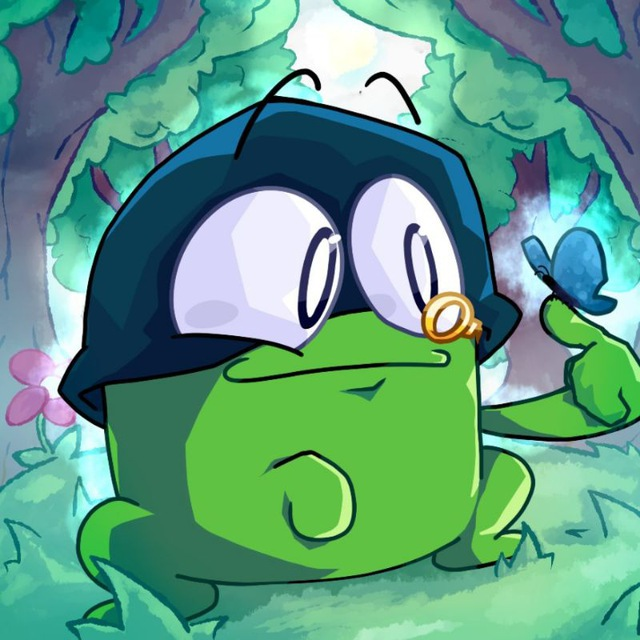

<h1 align="center">Botyan — Kate Artivian</h1>

  
  

**Botyan** is a cross-platform bot for Telegram and Discord, embodying the persona of Kate Artivian (*Kate Artivian*).  
This bot was created for chatting, jokes, mini-games, demotivator generation, and fun in your chats.

## What Kate Artivian Can Do

- **Conversation**  
  Engages in dialogue, replies to messages, and sometimes joins the chat on her own.

- **One persona for your chats**  
  Kate Artivian is a single character across both Telegram and Discord: the bot remembers your entire conversation history on both platforms. You can start a chat in Telegram, continue in Discord — and Kate will always keep track of the context.

- **Slots and Balance**  
  Mini-game with virtual currency: check your balance and play slots.

- **Demotivators**  
  Generates demotivators from attached or previously shared images in the chat.

- **Photo**  
  Sends a random photo from a source on command.

- **Telegram Video Note Effects**  
  Adds filters and effects to video notes (circles) in Telegram.

- **Automatic Messages**  
  Periodically sends messages to the chat on her own.

- **Menu and Hints**  
  Shows a list of available commands and explains features.

- **Limits and Key Status**  
  Displays API key limits and their status.

---

## Quick Start

The bot works both in **Telegram** and **Discord** — interfaces and commands are as similar as possible.

- **In Telegram:** all commands start with the letter `k` (for example, `k menu`, `k bal`, `k demo`, etc.).
- **In Discord:** use the familiar `!` prefix (for example, `!menu`, `!balance`, `!demotivator`).

---

## Bot Features Overview

| Feature                   | Discord | Telegram |
|---------------------------|:-------:|:--------:|
| 💬 Conversation           |   ✅    |    ✅    |
| 🎰 Slots / Balance        |   ✅    |    ✅    |
| 🖼️ Demotivator            |   ✅    |    ✅    |
| 📷 Photo from Source      |   ❌    |    ✅    |
| 📹 Video Filters for Clips|   ❌    |    ✅    |
| 🧠 Auto Messages / Other  |   ✅    |    ✅    |
| 📖 Menu / Help            |   ✅    |    ✅    |

---

## Inspiration & Credits

Special thanks to the following projects:

bot — [@sglypa_tg_bot](https://t.me/sglypa_tg_bot)  
channel — [@sglypa](https://t.me/sglypa)

community — [vk.com/neurodemotivators](https://vk.com/neurodemotivators)

Thank you for the inspiration and the great mood you bring!

---

## Important

**All responsibility for using this bot and all generated content and messages lies solely with the users themselves.**  
As the author and developer, I take no responsibility for the actions of the bot, the content of messages, or any consequences of its use.  
Use at your own risk.

**Kate Artivian is a completely fictional character.**  
Her persona and photos were generated by a neural network.  
Any resemblance to real people, names, or events is purely coincidental and unintended.

**Please note:**  
The bot works by connecting to a language model, for which various prompts and parameters are used.  
As the author, I do not provide my own prompts or specific instructions — the project includes only templates and basic logic.  
**All settings, prompts, texts, as well as the choice of models and their use — are entirely up to the user.**  
Therefore, responsibility for the final functionality, behavior, and all content generated by the bot rests solely with the user who configures and uses the bot.

---

**Enjoy, friends!**  
*Botyan & Kate Artivian are always here to make your chat more fun!*
