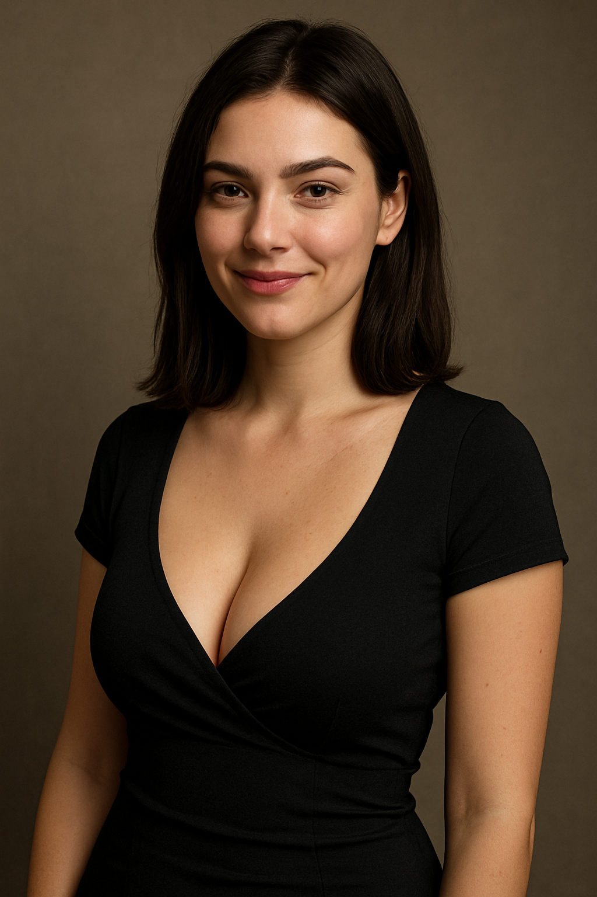

<h1 align="center">Botyan — Kate Artivian</h1>

  
  

**Botyan** is a cross-platform bot for Telegram and Discord, embodying the persona of Kate Artivian (*Kate Artivian*).  
This bot was created for chatting, jokes, mini-games, demotivator generation, and fun in your chats.

## What Kate Artivian Can Do

- **Chatting**  
  Just message the bot or reply to her message — she’ll keep the conversation going. Sometimes, Kate herself jumps into the chat to add some life and humor.

- **Slots**  
  A built-in mini-game with virtual currency and a slot machine. Check your balance, place bets — and try your luck!

- **Demotivators**  
  Generate demotivators from pictures: attach an image or use a special command, and the bot will even pick a random picture from chat history.

- **Video Effects**  
  Send a video-note (circle video), and Kate will apply a filter or effect by your command.

- **Automatic Messages**  
  From time to time, the bot will write something in the chat by itself.

- **Menu & Tips**  
  You can get a list of commands at any time.

---

## Quick Start

The bot works both in **Telegram** and **Discord** — interfaces and commands are as similar as possible.

- **In Telegram:** all commands start with the letter `k` (for example, `k menu`, `k bal`, `k demo`, etc.).
- **In Discord:** use the familiar `!` prefix (for example, `!menu`, `!balance`, `!demotivator`).

---

## Inspiration & Credits

Special thanks to the following projects:

bot — [@sglypa_tg_bot](https://t.me/sglypa_tg_bot)  
channel — [@sglypa](https://t.me/sglypa)

community — [vk.com/neurodemotivators](https://vk.com/neurodemotivators)

Thank you for the inspiration and the great mood you bring!

---

## Important

**All responsibility for using this bot and all generated content and messages lies solely with the users themselves.**  
As the author and developer, I take no responsibility for the actions of the bot, the content of messages, or any consequences of its use.  
Use at your own risk.

**Kate Artivian is a completely fictional character.**  
Her persona and photos were generated by a neural network.  
Any resemblance to real people, names, or events is purely coincidental and unintended.

**Please note:**  
The bot works by connecting to a language model, for which various prompts and parameters are used.  
As the author, I do not provide my own prompts or specific instructions — the project includes only templates and basic logic.  
**All settings, prompts, texts, as well as the choice of models and their use — are entirely up to the user.**  
Therefore, responsibility for the final functionality, behavior, and all content generated by the bot rests solely with the user who configures and uses the bot.

---

**Enjoy, friends!**  
*Botyan & Kate Artivian are always here to make your chat more fun!*
