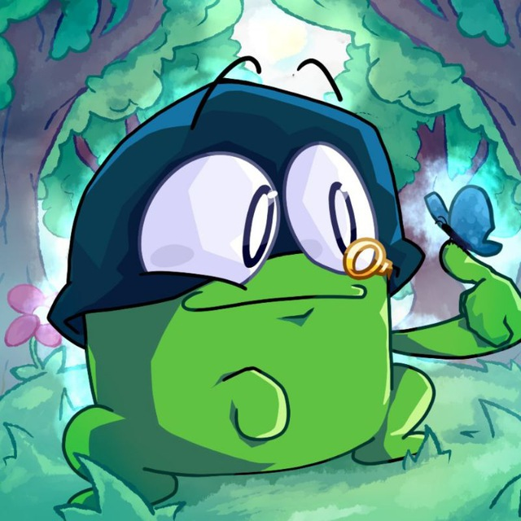
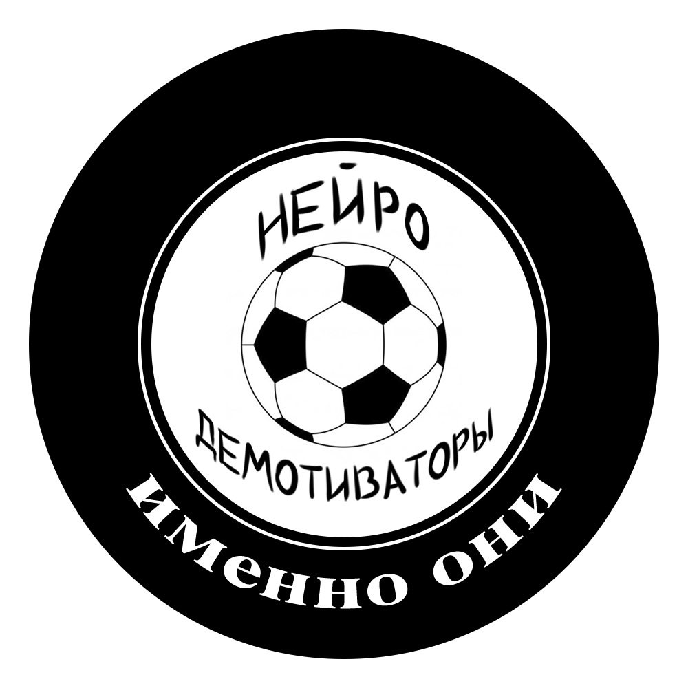

<h1 align="center">Botyan — Kate Artivian</h1>

  
  

**Botyan** — это мультиплатформенный бот для Telegram и Discord, воплощающий образ Кейт Артивиан (*Kate Artivian*).  
Бот создан для общения, шуток, игровых механик, генерации демотиваторов и развлечений в чатах.

## Что умеет Kate Artivian

- **Общение**  
  Поддерживает беседу, отвечает на сообщения и иногда сама вступает в диалог.

- **Один собеседник для чатов**  
  Kate Artivian — это единый персонаж для Telegram и Discord: бот запоминает всю историю общения в обоих мессенджерах. Можно начать разговор в Telegram, продолжить в Discord — и Kate всегда будет в курсе контекста.

- **Слоты и баланс**  
  Мини-игра с виртуальной валютой: проверяй баланс и играй в слоты.

- **Демотиваторы**  
  Генерирует демотиваторы из прикреплённых или найденных в чате изображений.

- **Фото**  
  Присылает случайное фото из источника по команде.

- **Эффекты для кружоков Telegram**  
  Добавляет фильтры и эффекты к видео-кружкам.

- **Автоматические сообщения**  
  Периодически пишет в чат сама.

- **Меню и подсказки**  
  Показывает список доступных команд и объясняет функционал.

- **Лимиты и статус ключей**  
  Показывает лимиты API-ключей и их статус.

---

## Быстрый старт

Бот доступен как в **Telegram**, так и в **Discord** — интерфейс и команды максимально похожи.

- **В Telegram:** все команды начинаются с буквы `k` (например, `k menu`, `k bal`, `k demo`, и т.д.).
- **В Discord:** используй привычный стиль команд через префикс `!` (например, `!меню`, `!баланс`, `!демотиватор`).

---

## Обзор функций бота

| Функция                   | Discord | Telegram |
|---------------------------|:-------:|:--------:|
| 💬 Общение                |   ✅    |    ✅    |
| 🎰 Слоты / Баланс         |   ✅    |    ✅    |
| 🖼️ Демотиватор            |   ✅    |    ✅    |
| 📷 Фото из источника      |   ❌    |    ✅    |
| 📹 Видеофильтры на кружки |   ❌    |    ✅    |
| 🧠 Автосообщения / Прочее |   ✅    |    ✅    |
| 📖 Меню / Помощь          |   ✅    |    ✅    |

---

## Вдохновение и благодарности

Отдельное спасибо проектам:

бот — [@sglypa_tg_bot](https://t.me/sglypa_tg_bot)
канал — [@sglypa](https://t.me/sglypa)

группа — [vk.com/neurodemotivators](https://vk.com/neurodemotivators)

Спасибо за вдохновение и отличное настроение, которое вы дарите!

---

## Важно

**Вся ответственность за использование данного бота, а также за весь сгенерированный контент и сообщения лежит исключительно на самих пользователях.**  
Я, как автор и разработчик, не несу ответственности за действия бота, содержимое сообщений и любые последствия его использования.  
Пользуйтесь на свой страх и риск.

**Kate Artivian — это полностью выдуманный персонаж.**  
Её образ и фотографии сгенерированы нейросетью.  
Любые совпадения с реальными людьми, именами или событиями являются случайными и непреднамеренными.

**Внимание:**  
В основе работы бота лежит подключение к языковой модели, для которой используются различные промпты и параметры.  
Я, как автор, не предоставляю собственные промпты или специфические инструкции — в проекте есть только шаблоны и базовая логика.  
**Все настройки, промпты, тексты, а также выбор моделей и их использование — полностью на стороне пользователя.**  
Соответственно, ответственность за итоговый функционал, поведение и весь генерируемый ботом контент лежит только на пользователе, который настраивает и использует бота.

---

**Enjoy, друзья!**  
*Botyan & Kate Artivian всегда рядом, чтобы сделать ваш чат интереснее.*
